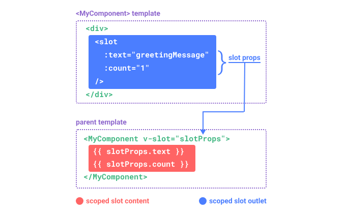

#### Vue-5

- Vue Component

- template engine
- script setup
- stylesheet

- #### Reactivity

1. ref
2. reactive

- #### Vue3 Derictves

1. v-bind: -> :
2. v-on: -> @
3. v-if , v-else , v-else-if
4. v-show
5. v-for
6. v-once (caching)
7. v-memo
8. v-html
9. v-pre
10. v-slot
11. v-model

- ### Watchers
- computed
- watch
- watchEffect

## Props

1.

```vue
defineProps({ text:String })
```

2.

```
const props=defineProps({
    text:{
        type:String
        required:true,
        default:'Bu yerda matn'
    }
})
```

### - Slots

<code> Container.vue </code>

```
<template>
   <slot text="Container 1"/>
</template>

```

```
<Container v-slot="props">
 <h1> Content {{props.text}} </h1>
</Container>

```


